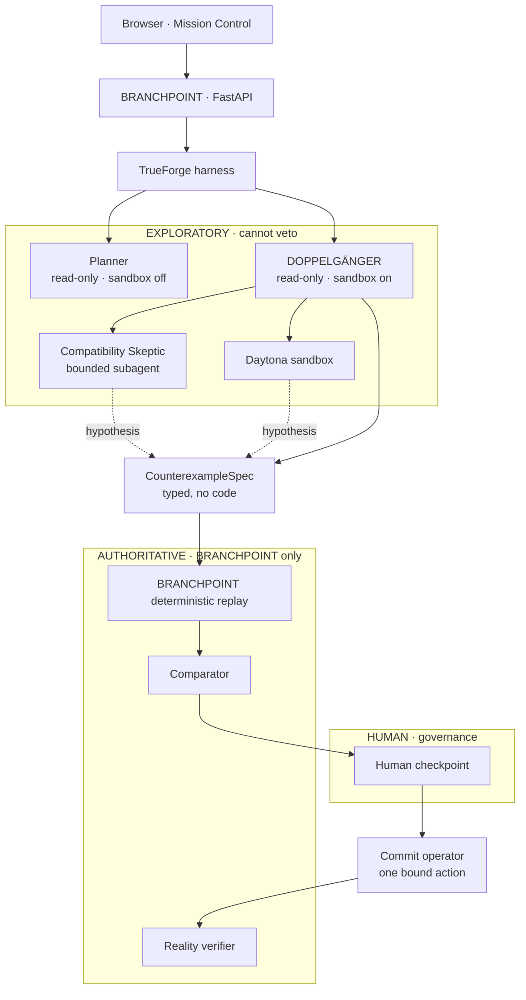

# BRANCHPOINT

**Agents get branches before they get permissions.**

AI agents shouldn't predict the future. They should rehearse it.

## Contents

| Section | Link |
|---|---|
| Team | [Team](#team) |
| Live Links | [Live Links](#live-links) |
| The problem | [The problem](#the-problem) |
| The idea | [The idea](#the-idea) |
| Evidence > confidence | [Evidence > confidence](#evidence--confidence) |
| Hero example | [Hero example](#hero-example) |
| Architecture | [Architecture](#architecture) |
| TrueForge usage | [TrueForge usage](#trueforge-usage) |
| Safety model | [Safety model](#safety-model) |
| Running locally | [Running locally](#running-locally) |
| Deployed setup | [Deployed setup](#deployed-setup) |
| Vercel configuration | [Vercel configuration](#vercel-configuration) |
| Railway configuration | [Railway configuration](#railway-configuration) |
| Tests | [Tests](#tests) |
| Code quality | [Code quality](#code-quality) |
| Limitations | [Limitations](#limitations) |
| Docs | [Docs](#docs) |

## Team

Team Name: Proof of Chaos (POC)
Members: Yash Mishra, Udit Rawal, Mohit Kushwaha


## Live Links

Live App: https://branchpoint-three.vercel.app/
Repository: https://github.com/mohitkushwaha0601/BranchPoint
Commit History: https://github.com/mohitkushwaha0601/BranchPoint/commits/main/
Pull Requests: https://github.com/mohitkushwaha0601/BranchPoint/pulls?q=
Releases: https://github.com/mohitkushwaha0601/BranchPoint/releases
License: https://github.com/mohitkushwaha0601/BranchPoint?tab=MIT-1-ov-file
Demo Video: https://www.youtube.com/watch?v=rbIDI6maFDY

## The problem

Autonomous agents often get one production environment and one chance.

A plausible rollback can restore headline metrics while silently breaking schema compatibility, payments, data integrity, or another invariant. The dashboard goes green and the damage is somewhere nobody is looking.

## The idea

BRANCHPOINT creates counterfactual branches before granting permission to change reality.

```
Observe → Plan → Fork → Rehearse → Attack → Replay → Compare
        → Human Approval → Commit → Verify
```

Every candidate action is executed against its own isolated copy of production. An adversary attacks each branch. BRANCHPOINT replays whatever the adversary proposes and decides for itself. A human approves exactly one bound action, and an independent verifier re-reads reality afterwards.

## Evidence > confidence

DOPPELGÄNGER — the adversarial agent — investigates a world with read-only tools and a Daytona sandbox it may run code in. It can delegate to a subagent. Every one of those findings is recorded `machine_verifiable=False`.

A failure matters only after BRANCHPOINT's own deterministic replay reproduces it against that world's snapshot. Only that replay produces `machine_verifiable=True` evidence, and only such evidence can veto.

> **DOPPELGÄNGER is allowed to be creative. It is not allowed to be authoritative.**

A counterexample claiming `REPRODUCED` without qualifying evidence behind it serializes as `reproduced: true, authoritative: false` and vetoes nothing.

## Hero example

Checkout is at **41.3% error, 4.8s p95** after pricing-service v2.41.

| | Action | Rehearsal | Verdict |
|---|---|---|---|
| **α** | rollback `v2.41 → v2.40` | headline metrics recover | **VETOED** |
| **β** | disable `PRICING_V2` | recovers, no invariant break | **RECOMMENDED** |
| **γ** | scale replicas | partial improvement, higher cost | SURVIVED, ranked lower |

α looks best on the dashboard. DOPPELGÄNGER suspects the older runtime cannot read orders written under schema 41; BRANCHPOINT replays that hypothesis, reproduces `schema_compatibility` and `payment_retry` failures, and vetoes it.

β is recommended by the deterministic comparator — not by a model score. A human then approves it, BRANCHPOINT commits exactly that bound action, and an independent verifier confirms reality changed.

## Architecture



Everything above the `CounterexampleSpec` boundary is a hypothesis. Everything below it is something BRANCHPOINT checked itself.

## TrueForge usage

| Feature | How BRANCHPOINT uses it | Where judges see it |
|---|---|---|
| **MCP** | 17 typed tools; 13 read-only, 4 destructive. Each agent gets a named subset — the planner cannot reach a mutation tool at all | Harness tab → `MCP · branchpoint_*` |
| **Sandbox** | Daytona sandbox for DOPPELGÄNGER only, for exploratory reproducers | Harness tab → `Daytona sandbox created`, `exitCode 0` |
| **Dynamic subagent** | Real `create_sub_agent` delegation to a bounded *Compatibility Skeptic* on the rollback world | Harness tab → `Subagent · Compatibility Skeptic` |
| **Human approval** | The destructive commit tool pauses on TrueForge's approval gate; BRANCHPOINT resumes it only against an approval it already holds | Harness tab → `Human approval required` → `Approved call executed` |
| **Persistent sessions** | Run/world/purpose bound to TrueForge session ids; reload rejoins the same sessions | Harness tab → `SESSION CONTINUITY · RESTORED` |
| **Harness Trace** | TrueForge's own event log, normalized and redacted by the backend | Bottom drawer → **Harness** |
| **Skill** *(optional)* | `incident-counterfactual-review` playbook, **off by default** — see [`trueforge/README.md`](trueforge/README.md) | Not enabled unless registered |

## Safety model

| Role | Privileges | Authority |
|---|---|---|
| **Planner** | read-only reality tools, sandbox **off** | none |
| **DOPPELGÄNGER** | read-only *world* tools, sandbox **on** | exploratory |
| **Compatibility Skeptic** | inherits the parent's read-only tools | exploratory |
| **BRANCHPOINT replay** | in-process, deterministic, closed allowlists | **authoritative** |
| **Commit operator** | one destructive tool, sandbox **off**, approval-gated | executes a bound action |
| **Verifier** | re-reads reality independently after commit | **authoritative** |

A commit additionally requires an exact action fingerprint match and a one-time capability that is consumed atomically.

## Running locally

```bash
# 1. backend  (http://localhost:8000)
cd backend && uv sync --dev
BRANCHPOINT_TRUEFORGE_SANDBOX_ENABLED=true uv run uvicorn app.main:app --port 8000

# 2. TrueForge (http://localhost:8790) + a model provider + MCP registration
npx @truefoundry/trueforge@0.1.4
./trueforge/scripts/setup_trueforge.sh
export BRANCHPOINT_MODEL="<provider>/<model-id>"

# 3. frontend (http://localhost:5173) — proxies /api and /health to the backend
cd frontend && npm install && npm run dev
```

Open `http://localhost:5173/runs` and press **Run BRANCHPOINT**. `/demo/hero` renders an offline fixture with no backend.

No model, TrueForge, or Daytona credential ever reaches the browser. The model provider's key lives in TrueForge; BRANCHPOINT holds none.

## Deployed setup

The current deployment uses Vercel for the frontend and Railway for the backend
services.

| Component | Deployment | Port / URL |
|---|---|---|
| Frontend | Vercel | https://branchpoint-three.vercel.app |
| BRANCHPOINT backend | Railway service branchpoint | private port 8000 |
| Backend health | Railway | https://branchpoint-production.up.railway.app/health |
| TrueForge | Railway service TrueForge | private port 8080 |
| TrueForge private URL | Railway | http://trueforge.railway.internal:8080 |
| Backend private URL | Railway | http://branchpoint.railway.internal:8000 |
| MCP URL | TrueForge to backend | http://branchpoint.railway.internal:8000/mcp |

Railway private hostnames resolve only from another service in the same Railway
environment. The public backend domain is for browser traffic; the private
URLs are for TrueForge-to-backend communication.

### Vercel configuration

~~~
Root Directory: frontend
Framework Preset: Vite
Install Command: npm ci
Build Command: npm run build
Output Directory: dist
Node.js Version: 22.x
~~~

Set VITE_API_BASE_URL to https://branchpoint-production.up.railway.app for
Preview and Production. Vercel uses the native Vite build; the frontend
Dockerfile is for CI/container validation.

### Railway configuration

Set these variables on the Railway service named branchpoint:

~~~
PORT=8000
BRANCHPOINT_ENV=production
BRANCHPOINT_TRUEFORGE_BASE_URL=http://trueforge.railway.internal:8080
BRANCHPOINT_MODEL=<exact model configured in TrueForge>
BRANCHPOINT_CORS_ALLOW_ORIGINS=https://branchpoint-three.vercel.app,http://localhost:5173,http://127.0.0.1:5173,http://localhost:3000,http://127.0.0.1:3000
~~~

Set the TrueForge service variable:

~~~
BACKEND_URL=http://branchpoint.railway.internal:8000/mcp
~~~

TrueForge must have a provider-backed model configured. A model appearing in
its local catalog is not sufficient if the upstream provider rejects the model
ID. For the direct OpenAI provider, use a model ID the OpenAI account can access.

The deterministic backend smoke flow does not require TrueForge:

~~~
BP_BASE_URL=https://branchpoint-production.up.railway.app
curl -sS $BP_BASE_URL/health
curl -sS $BP_BASE_URL/openapi.json
curl -sS $BP_BASE_URL/api/v1/demo/state
~~~

The deterministic run should progress to AWAITING_APPROVAL. Do not run approval,
reset, or commit operations as part of a basic health check.

## Tests

| | |
|---|---|
| Backend | **556** deterministic tests (`pytest`) |
| Frontend | **163** tests (`vitest` + Testing Library, `fetch` mocked) |

No test makes a model, network, TrueForge, or Daytona call.

```bash
cd backend  && uv run pytest && uv run ruff check . && uv run ruff format --check .
cd frontend && npm run typecheck && npm run test -- --run && npm run build
```

## Code quality

- **Qodo** reviews every pull request
- **GitHub Actions** — separate backend and frontend CI on PRs and `main`
- **Ruff** check + format, clean across 137 files
- **Strict TypeScript** (`strict`, `noUncheckedIndexedAccess`) — clean
- **pytest** / **Vitest**

## Limitations

Stated plainly, because they matter for judging:

- Active BRANCHPOINT runs live in **process memory**. A backend restart ends
  in-flight runs; the UI says so rather than pretending otherwise.
- **One backend worker** is required — the run store and the background drive
  runner are process-wide singletons.
- The optional TrueForge skill needs a reachable TrueForge and a public git repo
  to register; it is off by default and its registration cannot be verified
  offline.
- No claim of durable, production-grade orchestration persistence. TrueForge
  persists its own sessions in SQLite; BRANCHPOINT stores only the binding.

## Docs

- [`docs/ARCHITECTURE.md`](docs/ARCHITECTURE.md) — lifecycle, authority, boundaries
- [`docs/JUDGING.md`](docs/JUDGING.md) — judging dimensions mapped to verifiable proof
- [`docs/DEMO.md`](docs/DEMO.md) — 2:40 demo script
- [`trueforge/README.md`](trueforge/README.md) — TrueForge setup and the optional skill
