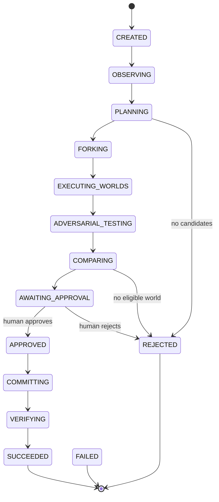
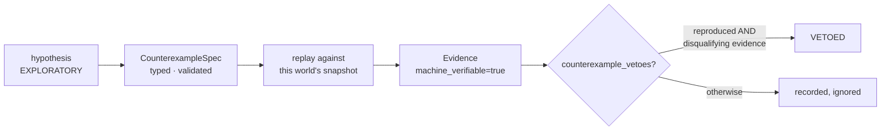
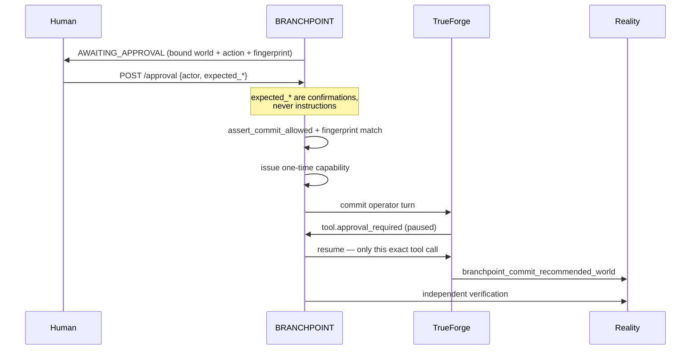

# BRANCHPOINT architecture

The technical detail behind [the README](../README.md). One idea runs through all
of it: **an agent may propose anything; only BRANCHPOINT may conclude.**

---

## 1. Run lifecycle

A run is a deterministic state machine (`app/domain/runs/lifecycle.py`). Every
transition is asserted; an illegal one raises rather than being coerced.



Every state may fail to `FAILED`. **No failure path can reach `SUCCEEDED`** —
TrueForge being down, a model timeout, an unparseable reply, a sandbox failure,
a malformed spec, or an interrupted session all become `FAILED`, never "safe".

`POST /api/v1/agent-runs` returns `202` with the run id immediately and drives
the pipeline in-process. A drive that raises converts to that run's own `FAILED`
state, so a client always learns what happened.

---

## 2. The counterfactual world model

One world per candidate action, each with its own isolated snapshot of demo
production. Worlds have their own state machine:

```
CREATED → PREPARING → EXECUTING → ATTACKING → EVALUATING → SURVIVED | VETOED | FAILED
```

A world holds its `candidate_action`, its measured `ExecutionOutcome`, its
`evidence`, its `counterexamples`, and a settled `verdict`. Domain objects are
frozen: every state change returns a revalidated copy.

Nothing a world does can reach reality. The replay engine reads a world's
snapshot; the mutator is a different adapter behind the capability gate.

---

## 3. Evidence authority

`Evidence.machine_verifiable` is the **only** authority bit.

```python
@property
def disqualifies(self) -> bool:
    return self.machine_verifiable and self.is_failing
```

Authority is never inferred from `source`. A sandbox probe and a replay result
both carry a source string; only one carries the bit. A validator refuses
machine-verifiable evidence with no pass/fail outcome — a check that proves
nothing cannot claim to.

| Producer | `machine_verifiable` | Can veto |
|---|---|---|
| DOPPELGÄNGER sandbox / subagent / prose | `False` | never |
| Harness Trace entries | *not evidence at all* | never |
| World executor checks | `True` | yes, if failing |
| BRANCHPOINT replay | `True` | yes, if failing |

---

## 4. Counterexample reproduction

DOPPELGÄNGER submits a typed `CounterexampleSpec` — an operation, an assertion,
and an order selector, all from closed allowlists. **There is no way to submit
code.** An unknown operation or check name is rejected as `ERROR`, not mapped
onto something plausible.



The attacker states the property that *should* hold. The counterexample is
reproduced exactly when the world violates it:

```python
def counterexample_vetoes(counterexample, evidence_by_id) -> bool:
    if counterexample.status is not CounterexampleStatus.REPRODUCED:
        return False
    return any(
        (item := evidence_by_id.get(eid)) is not None and item.disqualifies
        for eid in counterexample.evidence_ids
    )
```

Both halves are required. An adversary asserting `REPRODUCED` with only sandbox
output behind it is recorded and ignored — never rejected, so an untrusted
adversary cannot halt a run by making claims either.

The attacker also cannot supply a threshold. BRANCHPOINT owns every declared
invariant's bound; a submitted threshold discards the whole counterexample.

---

## 5. DOPPELGÄNGER trust boundary

Everything originating inside the adversary's session — sandbox `exec`, files it
wrote, scripts it ran, a subagent's summary, its own prose — is recorded under
one provenance with `machine_verifiable=False`.

Its session has eight read-only world tools by literal name. **No mutation tool
is enabled**, so TrueForge's Code Mode destructive-classification concern cannot
apply to it: classification is irrelevant to a tool that is not there.

Enabling the sandbox changes no tool exposure. The agent spec's `mcp_servers`
block is byte-identical with the sandbox on or off.

---

## 6. TrueForge's role

TrueForge is the **agent harness**. BRANCHPOINT is the safety, evidence, and
execution core.

| TrueForge owns | BRANCHPOINT owns |
|---|---|
| Model execution, sessions, turns | Typed domain contracts and invariants |
| Subagents (`create_sub_agent`) | The digital twin and world isolation |
| Sandbox provisioning and execution | Deterministic metrics |
| Human tool-approval checkpoints | Evidence validity and reproduction |
| Persistence of its own sessions | Verdicts, comparison, approval binding |
| | Capability authorization, mutation, verification |

**No model is ever authoritative** for evidence validity, a verdict, comparison,
approval, mutation authorization, or verification success.

### Harness Trace

`GET /api/v1/runs/{run_id}/harness-trace` normalizes TrueForge's own event log —
`sandbox.created`, `thread.created`, `tool.response`, `tool.approval_required`,
and the rest — into redacted rows. Redaction is by **allowlist**: entries are
built field by field from tool names, ids, categories, and exit codes. Tool
arguments, results, model prose, and credentials have no path into the output.

A trace is provenance about the runtime. It is not evidence, cannot reproduce a
counterexample, and cannot veto. TrueForge is never reachable from the browser.

---

## 7. Daytona isolation

The sandbox is opt-in (`BRANCHPOINT_TRUEFORGE_SANDBOX_ENABLED`, default off) and
**DOPPELGÄNGER-only**. The planner and commit operator are hardwired to
`sandbox.enabled: false` and never read the setting: nothing that reads reality
or writes to it is given code execution.

Sandbox-generated code never runs in the FastAPI process, and the sandbox cannot
reach reality. Its output is exploratory by construction.

If the sandbox is unavailable, the adversary fails closed like any other harness
failure — the world goes `INCONCLUSIVE`, never `SURVIVED`.

---

## 8. Subagent privilege boundary

The rollback world's brief asks for exactly one bounded `create_sub_agent`
delegation, named *Compatibility Skeptic*, with explicit no-further-delegation
bounds. TrueForge's mechanism is model-directed, so the brief is the mechanism.

Delegating grants nothing. The delegating and non-delegating agent specs have
identical `mcp_servers` and `config` blocks — a subagent inherits the same eight
read-only world tools. Its findings land in the same non-authoritative bucket.

A second model saying "broken" is still a model saying it.

---

## 9. Comparator determinism

Comparison is pure domain logic over measured outcomes: goal attainment,
regressions, blast radius, cost delta. No model participates. There is no
confidence score anywhere in the system.

A vetoed world is disqualified before ranking. The recommendation the human sees
is a deterministic ordering, and the UI says so: *"A deterministic
recommendation. Not permission."*

---

## 10. Approval binding

An approval is created only after comparison, only for a surviving world, only
for one comparison found eligible, and only once per run. It binds four things:
run, world, action id, and an **action fingerprint** — a SHA-256 of the action's
canonical content.



The client never says *what* to commit. It says yes to what BRANCHPOINT already
bound, and may restate what it believes it is approving; a mismatch is a `409`,
never an override. If the action changed after review, the fingerprint no longer
matches and the approval cannot be used.

### Human rejection

`POST /api/v1/runs/{run_id}/rejection` is a separate route on purpose: approval
is the only path that reaches the commit operator, and rejection has **no
reachable commit code at all**. It records a governance decision — the world's
verdict and evidence are untouched — and the run goes terminal `REJECTED`, which
every commit gate already refuses.

A veto and a human rejection are different layers, and the UI keeps them
visually distinct.

---

## 11. One-time commit capability

A capability is issued only for an `APPROVED` run whose binding still validates.
The raw token is returned exactly once, never logged, never stored in plaintext,
and consumed atomically on use.

Four independent layers guard the commit, none of which trusts the others:

1. BRANCHPOINT resumes only the exact paused tool call it approved
2. the MCP tool's own approval check
3. `assert_commit_allowed` — granted approval, matching world, surviving verdict, matching fingerprint
4. the one-time capability

A destructive MCP tool invoked directly, bypassing TrueForge entirely, is still
rejected without a valid capability. **Layer 4 is what actually enforces
safety**; the rest mean the model never gets the chance.

The capability token never reaches the model: not in its instructions, not in
its arguments, not in the tool's reply.

---

## 12. Verification

After a commit, a `RealityVerifier` re-reads reality and re-derives the expected
outcome independently of whatever the commit reported. A run reaches `SUCCEEDED`
only when verification `PASSED`; anything else is `FAILED`.

The UI claims *"CURRENT REALITY — VERIFIED CHANGE"* only when both the commit
succeeded and verification passed. A commit alone says the mutation was issued;
verification says reality actually reads that way.

---

## 13. Persistence limitations

Deliberate, and stated so judging is informed:

- **Active runs are in process memory.** A restart ends in-flight runs. The UI
  shows *"Run no longer exists"* with an honest explanation rather than a Retry
  that cannot succeed, and stops polling on the authoritative 404.
- **One worker required.** The run repository, event sink, session-binding
  store, and background runner are process-wide singletons. A second process
  would see none of the first's runs.
- **TrueForge persists its own sessions** (SQLite). BRANCHPOINT stores only a
  `TrueForgeSessionBinding` — run, world, purpose, session id, status, last turn
  — so a run can be reconnected after a reload. Re-binding the same
  run/world/purpose updates in place, so an interrupted run cannot duplicate a
  world or a commit.
- **Reconnect is session continuity, not durability.** Re-reading a run returns
  the same TrueForge session ids and schedules no second drive; it does not
  survive the backend process dying.
